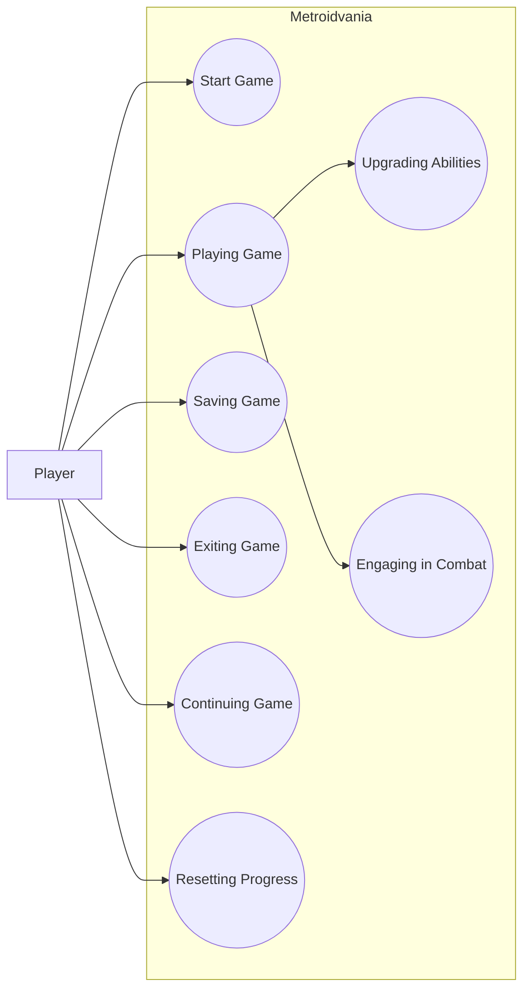
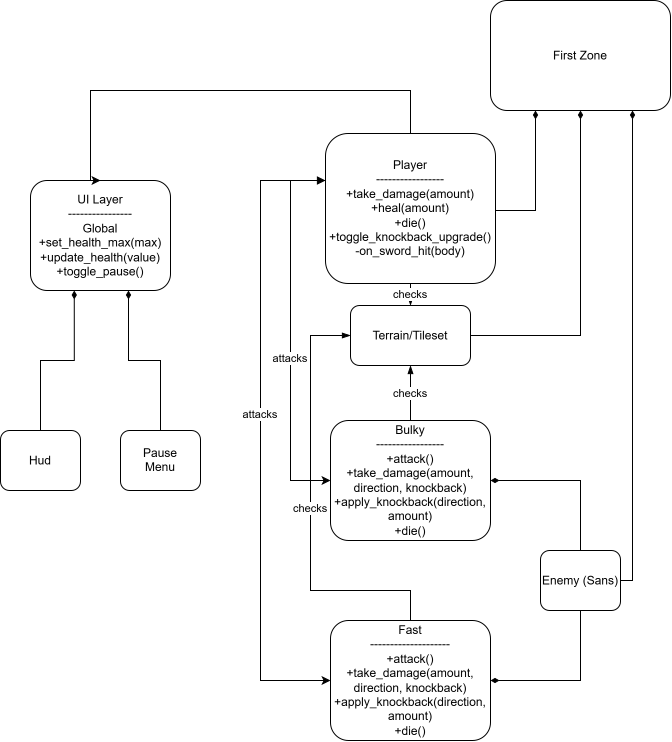

1. Overview

This project will be a short "Metroidvania"-style video game in which
players can control a character from a 2D side scrolling perspective to explore an
interconnected world, with a focus on smooth movement and tight, responsive
controls. By exploring the map and/or defeating bosses scattered around the world,
players can collect various items and upgrades to help them traverse the world, unlock new
pathways, and aid in combat with enemies/bosses. The game will be designed to be
beatable in one sitting.
____

2. Functional Requirements

    1. One interconnected map that is short enough for the player to beat in one-sitting. As the player makes progress, they should be able to collect items that make the player stronger over the course of the playthrough. With enough/all items, they would be able to defeat a final boss. This requirement is high priority. 

    2. Relatively simple but unrestrictive move set, allowing for a fun and memorable experience for the player. This includes a jump, double jump, attack, air attack, and dash. Items that are collected throughout the game will make these properties stronger/faster, as well as give some new abilities (subject to change). This requirement is high priority. 

____

3. Non-functional Requirements

   1. Control Responsiveness: Player movement should feel satisfying and natural relative to Godot's 2D physics engine, with immediate and predictable responses to player input. Movement should remain consistent throughout the map. Features such as coyote time should be implemented where appropriate so that difficult platforming feels challenging rather than frustrating.
  
   2. Level Readability: The structure of each area should clearly communicate its intended traversal path. When entering a new room, the player should be able to identify where they can go without excessive trial and error. Difficulty should come primarily from mastering movement and platforming rather than determining the intended path.

   3. Reliability: The player should be able to complete the game from beginning to end without encountering bugs that prevent progression. No area required for progression should become permanently inaccessible because of player mistakes, death, respawning, or unintended interactions with game mechanics.

   4. Maintainability: Game systems should be organized so that team members can modify individual components, such as enemies, player abilities, upgrades, and level sections, without requiring major changes to unrelated systems. Scripts, scenes, and assets should follow consistent naming and organizational conventions to reduce development complexity and merge conflicts.
   
____

4. Use Case Diagram

____

5. Class Diagram and/or Sequence Diagrams
   

____

6. Operating Environment

As of right now, the game is being built to target desktop and laptop computers with x86-64 processors or Apple Silicon. Because it is a relatively simple 2D game, it needs only modest hardware: a dual-core CPU, 4 GB of RAM, and an integrated GPU that supports OpenGL 3.3 or Vulkan. The primary input devices are a keyboard and, optionally, a controller if we have time to implement support for it. No network connection is required to play. The game will run on Windows 11 and macOS 27 operating systems (and possibly older versions, though we have yet to perform extensive testing for this). Players will receive a self-contained exported build, so they do not need to install the Godot engine. Our team has agreed to use Godot version 4.7.2 to build this project. The programming language we are using is GDScript, which is built into the engine; there are no external runtimes or libraries to install. The game is designed to run alongside other applications without interfering with them; it runs in a window or fullscreen as an ordinary user process so it needs no administrator privileges and installs no background services or drivers, save data is written only to the per-user application data folder and never to system or other applications' directories, it makes no network connections and collects no data so it won't conflict with firewalls or security software, and lastly it uses standard audio and graphics drivers shared with other applications without requiring exclusive access to either.

____

7. Assumptions and Dependencies

Assumptions:
<ol type="i">
    <li>Engine stability. The team will use a single Godot version for the whole project, and Godot's 2D physics will behave consistently enough across that version and across operating systems to deliver the movement feel described in NFR 1.</li>
    <li>Scope fits the schedule. One interconnected map with the full set of upgrades and a final boss (FR 1) can be completed by the final December deadline with a team of five.</li>
    <li>Team availability. All five members stay on the project and can contribute consistently each sprint.</li>
    <li>Player hardware and input. Players run the game on a desktop or laptop that meets the minimum specifications in the Operating Environment section, with a keyboard that can handle the dash, double jump, and attack inputs within the responsiveness expectations of NFR 1.</li>
    <li>Playtesting. The team and a few outside testers will be available to playtest, since "feels satisfying" and "readable level layout" (NFR 1 and 2) can only be verified by actual play.</li>
</ol>

Dependencies:
<ol type="i">
    <li>Godot Engine 4.7.2. Rendering, physics, input handling, and scene management all depend on it.</li>
    <li>GitHub. Version control, the issue tracker, and team coordination depend on it. Its availability and the team's merge discipline affect NFR 4 (maintainability and merge conflicts)</li>
    <li>Reused code and assets such as an existing enemy script that new enemies build on, or tutorial and boilerplate code.</li>
</ol>
